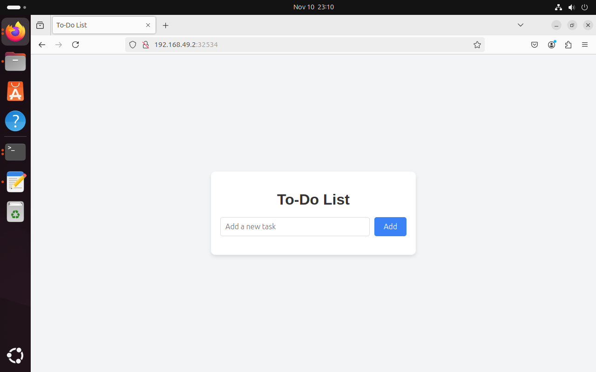

# PROYECTO DE LA MATERIA DE COMPUTACIÓN TOLERANTE A FALLAS

## Requisitos
Instalar minikube y docker para su ejecución de manera local

## Crear cluster:

minikube start --driver=docker

## Entrar al contenedor para crear las imagenes dentro del cluster:

eval $(minikube docker-env)

## Crear contenedores:

docker build -t backend-image ./backend
docker build -t frontend-image ./frontend

## Crear manifests:

kubectl apply -f ./manifests

## Obtener ip de minikube:

minikube ip

## Obtener informacion de los servicios, pods:
kubectl get svc
kubectl get pod

## Acceder desde el navegador a la ip de minikube y al puerto dado por el frontend

Ejemplo: 192.168.49.2:32534

### Ejemplo de pagina funcionando

## Para parar el cluster
minikube stop

